# PVNetwork — سامانه نمایندگی و فروش کانفیگ روی 3x-ui

پنل مدیریت **نمایندگی فروش (Reseller)** برای هسته [3x-ui](https://github.com/MHSanaei/3x-ui): چند سرور همزمان، پول ترافیک مشترک، وایت‌لیبل کامل با دامنه اختصاصی، پورتال اختصاصی برای هر کاربر نهایی و ساخت گروهی کاربران — همه با یک خط نصب.

> 🌐 این پروژه کاملاً **خودمیزبان (self-hosted)** است؛ هیچ سرویس بیرونی و هیچ اعتبارنامه پیش‌فرضی ندارد. همه دامنه‌ها و رمزها در زمان نصب توسط خودتان تعیین می‌شوند.

---

## 🇬🇧 Quick Start (English)

**PVNetwork** is a self-hosted reseller dashboard for [3x-ui](https://github.com/MHSanaei/3x-ui) (Xray core): manage multiple 3x-ui servers, allocate traffic pools to resellers, and give every reseller a white-labeled panel with its own brand, domain and user portal.

```bash
bash <(curl -fsSL https://raw.githubusercontent.com/DashSaman/PVNetwork-Reseller-Dashboard/main/install.sh)
```

Requirements: a fresh **Ubuntu/Debian** server with root access and a domain whose `A` record points to it. The installer sets up Docker, builds the panel from source, configures 3x-ui + HTTPS reverse proxy, and prints all credentials. Full documentation (with screenshots) is in Persian below — or ask your questions in [Issues](../../issues).

---

## ✨ قابلیت‌ها

- **چندپنلی** — چند سرور 3x-ui را همزمان وصل کنید؛ اینباندهای هر کدام را به هر نماینده اختصاص دهید
- **پول ترافیک** — سهمیه گیگابایتی مشترک برای هر نماینده؛ ساخت کاربر جدید از پول کم می‌شود و از دسترسی خارج می‌شود
- **وایت‌لیبل کامل** — نام برند + دامنه اختصاصی برای هر نماینده، با تأیید مالکیت از طریق رکورد TXT
- **پورتال کاربر نهایی** — صفحه اختصاصی `/s/<subId>` با برند نماینده: مصرف، انقضا، QR و لینک‌ها بدون لاگین
- **ساخت گروهی** — تا ۵۰ کاربر یکجا با نام‌گذاری خودکار و لیست ساب‌لینک‌های آماده کپی
- **آنلاین‌های لحظه‌ای** — دات سبز آنلاین کنار هر کاربر + مشاهده IPهای متصل هر کاربر
- **سرعت زنده سرور** — ↑↓ شبکه، CPU، اتصال‌های TCP و وضعیت Xray با به‌روزرسانی ۳ ثانیه‌ای
- **هشدار ۸۰٪** — هشدار مصرف بالای ۸۰٪ و نزدیکی انقضا (+ ارسال خودکار اعلان تلگرام)
- **تلگرام** — بات اختصاصی هر نماینده برای اعلان ساخت کاربر و هشدارهای مصرف
- **ورود دومرحله‌ای (2FA)** — Google Authenticator برای ادمین و هر نماینده
- **ضدبشکن ورود** — قفل خودکار پس از تلاش‌های ناموفق پشت‌سرهم
- **ابطال لینک اشتراک** — تعویض subId با یک کلیک؛ لینک قبلی فوراً از کار می‌افتد
- **مرتب‌سازی، جستجو، صفحه‌بندی و خروجی CSV** در لیست کاربران
- **بکاپ خودکار روزانه دیتابیس** با نگهداری ۷ نسخه آخر

---

## 🧭 معماری

```
                  کاربر نهایی (اپ موبایل/PC)
                          │  ساب subscription
                          ▼
      ┌───────────  Caddy (پورت 2053)  ───────────┐
      │  panel.example.com    →  پنل نمایندگی      │
      │  3xpanel.example.com  →  3x-ui (basePath)  │
      │  دامنه اختصاصی نماینده →  پورتال /s/<subId> │
      └────────────────────┬──────────────────────┘
                           ▼
               ┌──  pvnet-panel (Next.js)  ──┐      ┌──  pvnet-3x-ui (Xray)  ──┐
               │  ادمین / نماینده‌ها / کاربران │ ───► │  اینباندها و کلاینت‌ها     │
               │  SQLite: panel-data/        │ API  │  vless/vmess/trojan/ss    │
               └─────────────────────────────┘      └───────────────────────────┘
```

| جزء | نقش | پورت |
|---|---|---|
| `pvnet-caddy` | ورودی HTTPS همه چیز با SNI + گواهی وایلدکارد | 2053 |
| `pvnet-panel` | پنل نمایندگی (Next.js standalone + Prisma/SQLite) | 3001 (فقط لوکال) |
| `pvnet-3xui` | هسته 3x-ui و Xray (شبکه host) | 2087 وب + اینباندها |

---

## 🚀 نصب تک‌خطی

**پیش‌نیاز:** سرور Ubuntu/Debian تازه با دسترسی root + یک دامنه که رکورد `A` آن به سرور اشاره می‌کند.

```bash
bash <(curl -fsSL https://raw.githubusercontent.com/DashSaman/PVNetwork-Reseller-Dashboard/main/install.sh)
```

حالت غیرتعاملی (همه‌چیز از env — مناسب اتوماسیون):

```bash
PANEL_DOMAIN=panel.example.com \
ROOT_DOMAIN=example.com \
CF_API_TOKEN=cfut_xxx \
bash <(curl -fsSL https://raw.githubusercontent.com/DashSaman/PVNetwork-Reseller-Dashboard/main/install.sh)
```

نصب‌کننده به‌ترتیب این کارها را انجام می‌دهد:

1. **Docker + Compose** — اگر نبود نصب می‌کند
2. **کلون مخزن** به `/opt/pvnet/repo`
3. **تولید رمزهای تصادفی** برای ادمین، 3x-ui و کلید رمزنگاری
4. **بیلد ایمیج پنل از سورس** (مرحله‌ای؛ فقط بار اول ۵–۱۵ دقیقه — روی سرورهای کم‌رم خودکار swap می‌سازد)
5. **پیکربندی 3x-ui**: رمز تصادفی + پورت 2087 + basePath تصادفی (مسیر مخفی پنل 3x-ui)
6. **اتصال پنل به 3x-ui** + ساخت اینباند پیش‌فرض `DE-VLESS-10000` (vless/tcp)
7. **گواهی**: با `CF_API_TOKEN` گواهی وایلدکارد واقعی Let's Encrypt با تمدید خودکار؛ بدون آن self-signed
8. **بکاپ روزانه دیتابیس** (۰۴:۳۰ — نگهداری ۷ نسخه)
9. چاپ همه آدرس‌ها و رمزها در `/opt/pvnet/CREDENTIALS.txt`

پس از نصب:

| آدرس | توضیح |
|---|---|
| `https://panel.example.com:2053` | پنل نمایندگی (ورود ادمین) |
| `https://3xpanel.example.com:2053/pvxxxxx/` | پنل 3x-ui (basePath تصادفی) |
| `https://panel.example.com:2053/s/<subId>` | پورتال هر کاربر نهایی |
| `https://panel.example.com:2053/apps` | مرکز دانلود اپ کاربران |

> **آپدیت نسخه‌های بعدی:** `bash /opt/pvnet/repo/update.sh` — خودکار بکاپ می‌گیرد، pull و بیلد و ری‌استارت می‌کند.

---

## 📖 راهنمای کامل پنل — همه منوها و دکمه‌ها

پنل دو نقش دارد: **ادمین** (مالک سامانه) و **نماینده** (فروشنده). هر دو از یک صفحه وارد می‌شوند و منوها بر اساس نقش نشان داده می‌شوند.

### ۱) صفحه ورود

هر دو نقش از همین صفحه وارد می‌شوند؛ سامانه خودش نقش را تشخیص می‌دهد. اگر ورود دومرحله‌ای فعال باشد، بعد از رمز، کد Authenticator هم پرسیده می‌شود. پنل حالت تاریک/روشن دارد (دکمه ماه در بالا-چپ) و انتخاب شما ذخیره می‌شود.

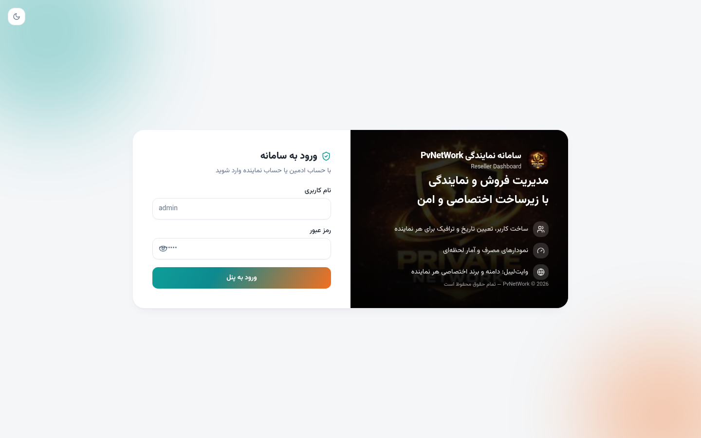

| عنصر | کارکرد |
|---|---|
| نام کاربری / رمز عبور | ورود ادمین یا نماینده — رمز را با دکمه «نمایش رمز» می‌بینید |
| ورود به پنل | ارسال فرم؛ در صورت قفل شدن ضدبشکن، پیام «دقیقه‌های باقی‌مانده» نشان داده می‌شود |
| دکمه ماه | تغییر حالت تاریک/روشن |

### ۲) داشبورد ادمین

نمای کلی سامانه: وضعیت هسته، آمار کلی، روند ساخت کاربران، ترافیک به تفکیک لوکیشن/اینباند و جریان زنده فعالیت‌ها.

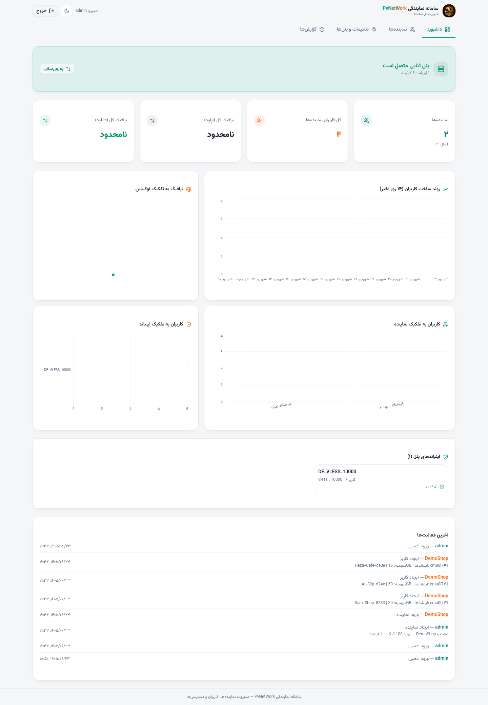

| بخش / دکمه | کارکرد |
|---|---|
| کارت «پنل ثابتی متصل است» | وضعیت اتصال به هسته 3x-ui (تعداد اینباند و کلاینت) |
| **به‌روزرسانی** | خواندن دوباره اینباندها و آمار از هسته |
| نماینده‌ها / کل کاربران / ترافیک کل (آپلود/دانلود) | چهار کارت آمار کلی |
| روند ساخت کاربران (۱۴ روز اخیر) | نمودار روزانه ساخت کاربر |
| ترافیک به تفکیک لوکیشن / اینباند / نماینده | نمودارهای توزیع مصرف |
| اینباندهای پنل | کارت هر اینباند با پروتکل و پورت + دکمه «پنل اصلی» |
| آخرین فعالیت‌ها | جریان زنده عملیات ادمین و نماینده‌ها (ورود، ساخت، حذف، تغییر رمز و…) |

### ۳) مدیریت نماینده‌ها (منوی «نماینده‌ها»)

ادمین برای هر فروشگاه/فروشنده یک «نماینده» می‌سازد. نماینده فقط داخل مرزی که ادمین تعیین می‌کند کار می‌کند: اینباندهای مجاز، پول ترافیک و قابلیت‌های مجاز.

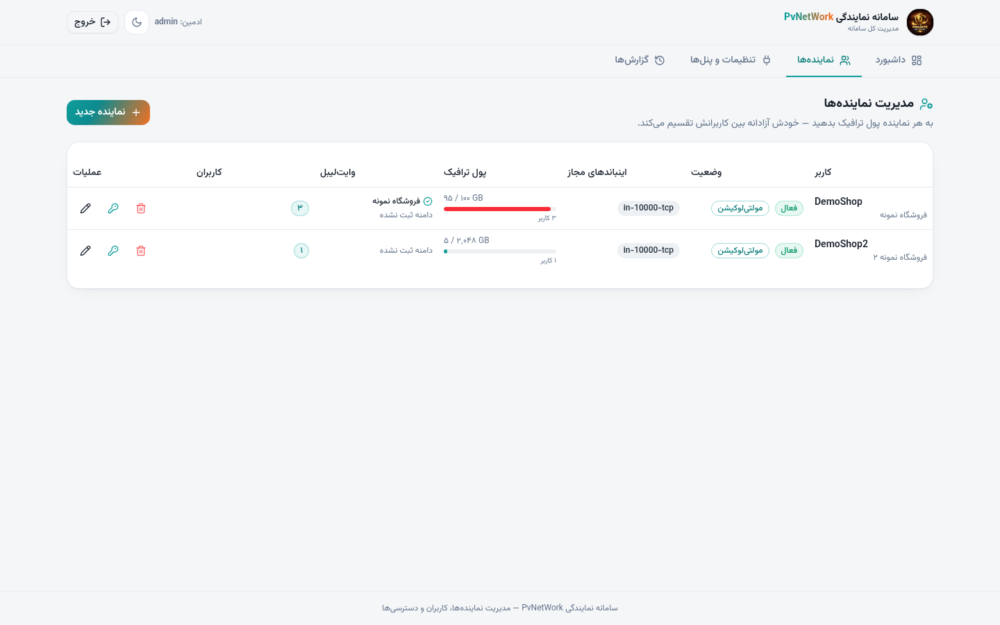

| ستون / دکمه | کارکرد |
|---|---|
| **+ نماینده جدید** | باز کردن فرم ساخت نماینده |
| کاربر | نام کاربری و نام نمایشی نماینده |
| وضعیت | بج «فعال» یا «معلق» |
| اینباندهای مجاز | اینباندهایی که نماینده اجازه ساخت کاربر روی آن‌ها را دارد |
| پول ترافیک | نوار مصرف پول (مصرف / سهمیه گیگابایت) + تعداد کاربران |
| وایت‌لیبل | برند و وضعیت دامنه اختصاصی نماینده |
| عملیات — ✏️ ویرایش | باز کردن دیالوگ ویرایش (بخش بعدی) |
| عملیات — ⏻ فعال‌سازی/غیرفعال‌سازی | سوییچ سریع وضعیت؛ نماینده معلق نمی‌تواند وارد شود |
| عملیات — 🗑 حذف | حذف قطعی نماینده و کاربرانش (با تأیید) |

### ۴) ویرایش نماینده

از همین دیالوگ، همه مرزهای یک نماینده کنترل می‌شود.

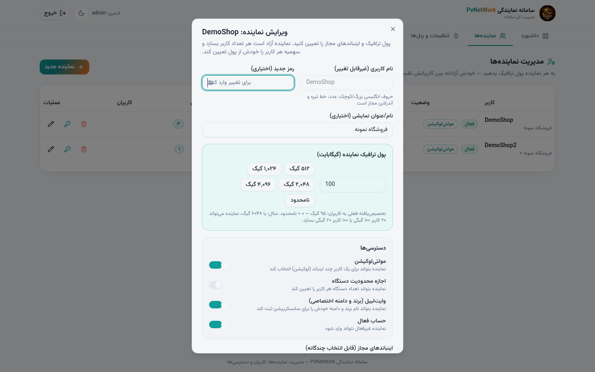

| فیلد / دکمه | کارکرد |
|---|---|
| نام کاربری (غیرقابل تغییر) | شناسه ورود نماینده |
| رمز جدید (اختیاری) | اگر خالی بماند رمز قبلی می‌ماند |
| نام/عنوان نماینده (اختیاری) | نام نمایشی در لیست و پیش‌نمایش برند |
| **پول ترافیک (گیگابایت)** | سهمیه مشترک؛ خالی/۰ = نامحدود. چیپ‌های سریع ۵۱۲/۱۰۲۴/۲۰۴۸/۴۰۹۶/۱۰۲۴۰ گیگ |
| مولتی‌لوکیشن | اجازه انتخاب چند اینباند (چند لوکیشن) برای هر کاربر |
| اجازه محدودیت دستگاه | نمایش فیلد «تعداد دستگاه» برای نماینده |
| وایت‌لیبل (دامنه اختصاصی) | اجازه تنظیم برند و دامنه اختصاصی توسط نماینده |
| حسب فعال | سوییچ فعال/معلق کردن نماینده |
| اینباندهای مجاز | تیک زدن اینباندها به تفکیک پنل |
| **خاموش‌سازی اضطراری ورود دومرحله‌ای** | اگر نماینده اپ Authenticator را از دست داده باشد، ادمین از همین‌جا 2FA او را خاموش می‌کند |
| ذخیره | اعمال تغییرات |

### ۵) تنظیمات سامانه (منوی «تنظیمات و پنل‌ها»)

حساب ادمین، 2FA، نام سامانه و پنل‌های متصل — همه از همین صفحه.

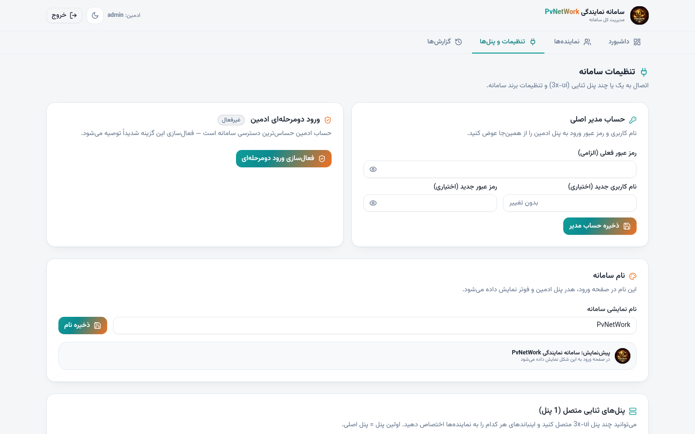

| کارت / فیلد | کارکرد |
|---|---|
| **حساب مدیر اصلی** | تغییر نام کاربری و رمز ادمین — برای امنیت، رمز فعلی دوباره پرسیده می‌شود؛ بعد از ذخیره، نشست تازه صادر می‌شود |
| **ورود دومرحله‌ای ادمین** | فعال‌سازی با اسکن QR در Google Authenticator؛ بعد از فعال‌سازی دکمه غیرفعال‌سازی جای آن را می‌گیرد |
| **نام سامانه** | برندی که در صفحه ورود، هدر پنل و صفحات عمومی دیده می‌شود + دکمه «ذخیره نام» و پیش‌نمایش زنده |
| ورود دومرحله‌ای (بج «غیرفعال/فعال») | وضعیت فعلی 2FA ادمین |

### ۶) پنل‌های 3x-ui متصل

پایین صفحه تنظیمات: لیست پنل‌های 3x-ui متصل. چند پنل = چند سرور؛ اولین پنل «پنل اصلی» است.

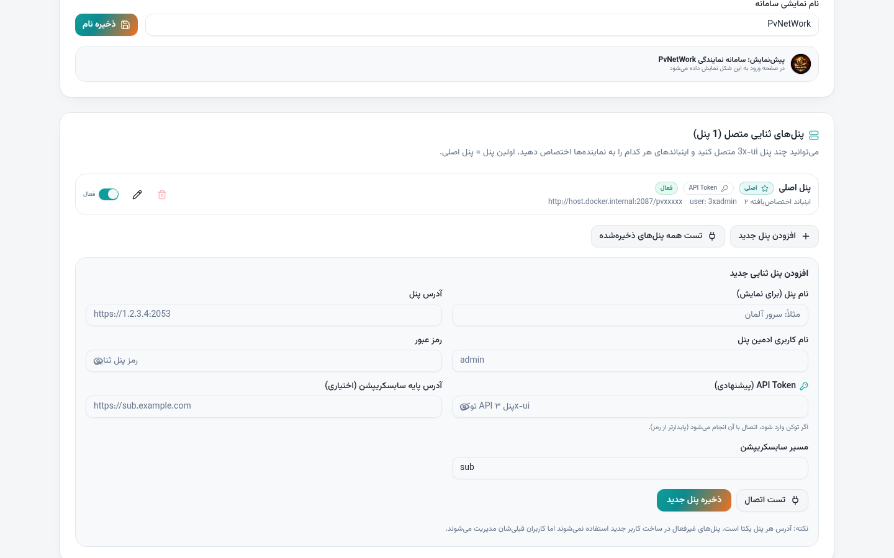

| فیلد / دکمه | کارکرد |
|---|---|
| **+ افزودن پنل جدید** | باز کردن فرم اتصال پنل تازه |
| نام پنل (برای نمایش) | مثلاً «سروور آلمان» — در لیست اینباندها و انتخاب نماینده‌ها دیده می‌شود |
| آدرس پنل | آدرس کامل وب 3x-ui با basePath، مثل `https://1.2.3.4:2053/pvxxxxx/` |
| نام کاربری / رمز عبور ادمین پنل | همان ورود مدیر 3x-ui |
| API Token (پیشنهادی) | اگر در 3x-ui ساخته‌اید؛ اتصال پایدارتر از نشست می‌شود |
| آدرس پایه سابسکریپشن (اختیاری) | پایه لینک ساب کاربران، مثل `https://sub.example.com` |
| مسیر سابسکریپشن | پیش‌فرض `sub` — مسیر انتهایی لینک ساب |
| **تست اتصال** | بررسی زنده اعتبارنامه‌ها قبل از ذخیره |
| **ذخیره پنل جدید** | ذخیره پنل در سامانه |
| سوییچ «فعال» | خاموش/روشن کردن موقت پنل بدون حذف |
| ✏️ ویرایش / 🗑 حذف | تغییر مشخصات یا حذف قطعی پنل |
| **تست همه پنل‌های ذخیره‌شده** | بررسی سلامت همه پنل‌ها یکجا |

### ۷) گزارش فعالیت‌ها (منوی «گزارش‌ها»)

تمام عملیات ادمین و نماینده‌ها با زمان و جزئیات: ورودها، ساخت/حذف کاربر و نماینده، تغییر رمز، تلاش‌های مسدودشده ضدبشکن و…

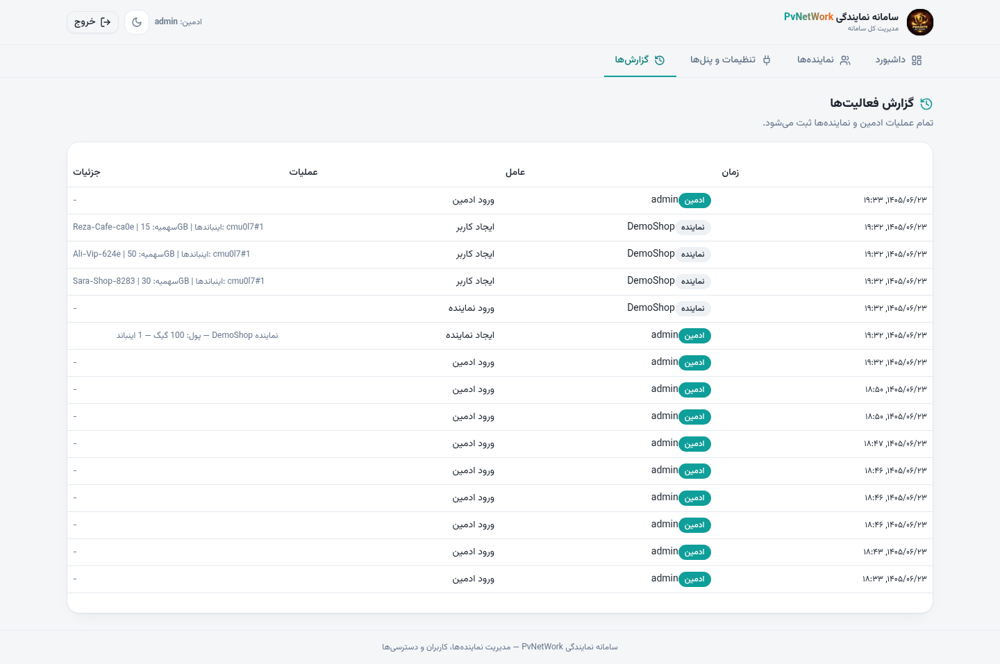

| ستون | محتوا |
|---|---|
| زمان | تاریخ و ساعت دقیق |
| عامل | ادمین یا نماینده انجام‌دهنده (با بج نقش) |
| عملیات | نوع عمل (ورود ادمین، ایجاد کاربر، حذف نماینده و…) |
| جزئیات | توضیح عمل؛ مثل «Sara-Shop-8283 \| سهمیه: 30GB \| اینباندها: …» |

### ۸) پنل نماینده — کاربران من (منوی «کاربران من»)

نماینده فقط کاربران خودش را می‌بیند. بالای صفحه: تعداد کاربران، تعداد آنلاین همین لحظه و هشدار «مصرف بالای ۸۰٪».

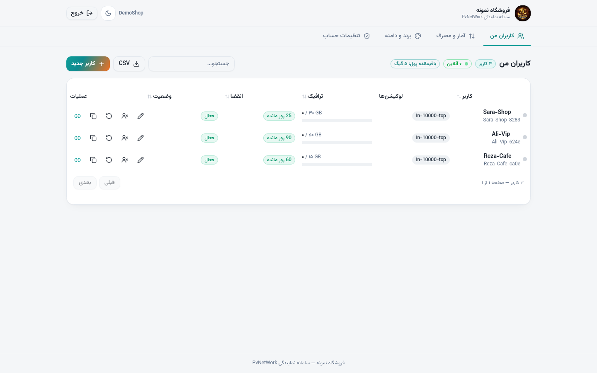

| عنصر / دکمه | کارکرد |
|---|---|
| **+ کاربر جدید** | باز کردن فرم ساخت کاربر (بخش ۱۰) |
| **CSV** | دانلود خروجی CSV کل لیست (سازگار با اکسل — UTF-8 با BOM) |
| جستجو… | جستجوی زنده در نام و شناسه کاربر |
| بج «N آنلاین» | تعداد کاربران متصل همین لحظه (به‌روزرسانی هر ۳۰ ثانیه) |
| بج «مصرف بالای ۸۰٪» | تعداد کاربرانی که از ۸۰٪ سهمیه گذشته‌اند |
| دات سبز/خاکستری کنار کاربر | آنلاین / آفلاین — با کلیک، IPهای متصل کاربر را می‌بینید |
| سرستون‌های ⭥ کاربر/ترافیک/انقضا/وضعیت | مرتب‌سازی صعودی/نزولی با کلیک |
| صفحه‌بندی «قبلی / بعدی» | ۲۰ کاربر در هر صفحه |
| 🔗 لینک‌ها و QR کاربر | باز کردن دیالوگ لینک‌ها (بخش ۱۱) |
| ⧉ کپی لینک ساب | کپی فوری لینک سابسکریپشن |
| ↺ ریست ترافیک | صفر کردن مصرف کاربر در هسته |
| 👤 دیدن IPها | لیست IPهای اخیراً متصل کاربر |
| ✏️ ویرایش / ⏻ فعال‌سازی / 🗑 حذف | تغییر سهمیه و انقضا، قطع/وصل سرویس، حذف کاربر |

### ۹) آمار و مصرف — منوی «آمار و مصرف»

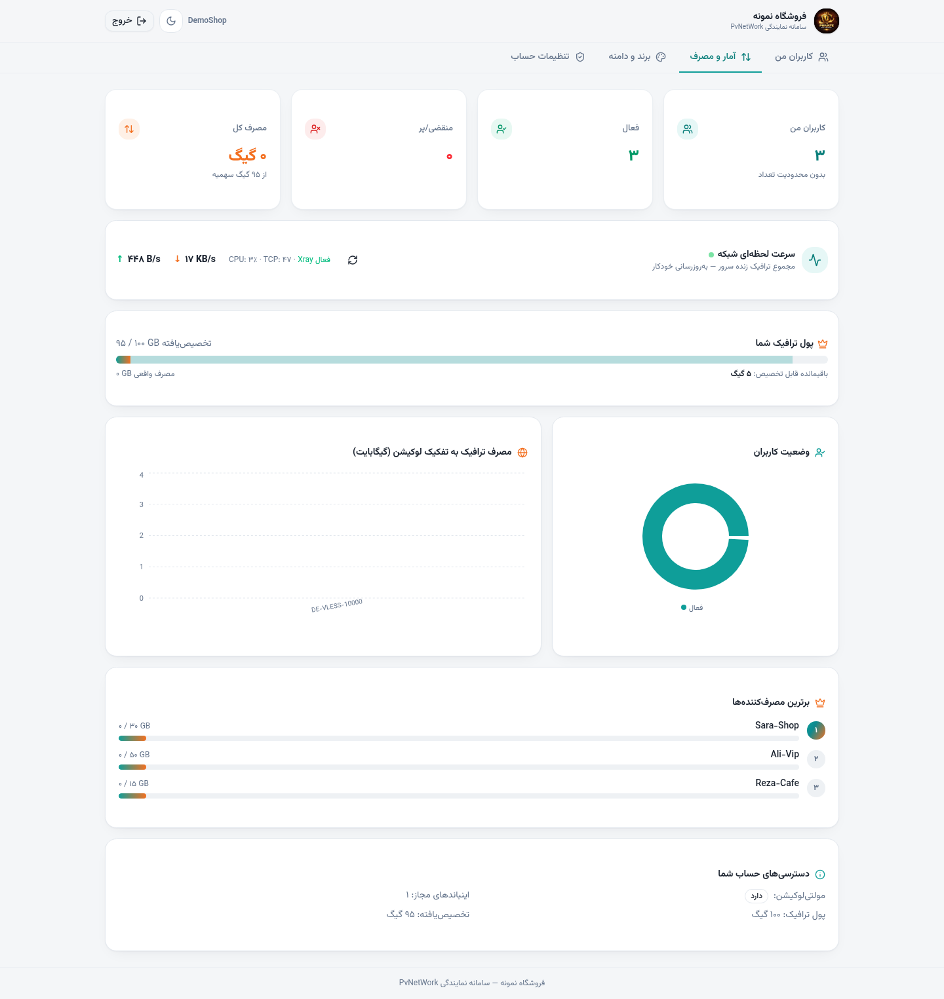

| بخش | کارکرد |
|---|---|
| کارت‌های آمار | کاربران من، فعال، منقضی/پر، مصرف کل (از سهمیه) |
| **سرعت لحظه‌ای شبکه** | ↑ آپلود / ↓ دانلود زنده، CPU، اتصال‌های TCP و وضعیت Xray — به‌روزرسانی هر ۳ ثانیه با دکمه ♻ برای خواندن دوباره |
| پول ترافیک شما | نوار مصرف پول مشترک + باقی‌مانده |
| وضعیت کاربران | نمودار دایره‌ای فعال/غیرفعال |
| مصرف ترافیک به تفکیک لوکیشن | نمودار میله‌ای اینباندها |
| برترین مصرف‌کننده‌ها | کاربران با بیشترین مصرف + نوار نسبت به سهمیه |
| دسترسی‌های حساب شما | خلاصه دسترسی‌های نماینده: مولتی‌لوکیشن، پول ترافیک، تخصیص‌یافته |

### ۱۰) ساخت کاربر — تکی یا گروهی

فقط نام + سهمیه + انقضا کافی است؛ بقیه کارها خودکار انجام می‌شود.

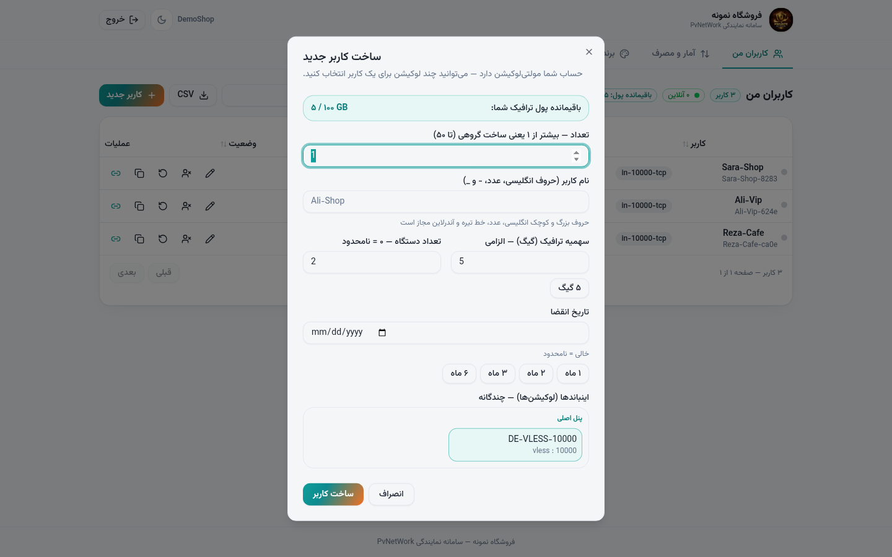

| فیلد / دکمه | کارکرد |
|---|---|
| باقیمانده پول ترافیک شما | یادآوری زنده سهمیه قابل استفاده |
| **تعداد (بیشتر از ۱ = ساخت گروهی)** | مثلاً ۱۰ = ده کاربر یکجا با نام‌های `Ali-Shop-1` تا `Ali-Shop-10` |
| نام کاربر | فقط حروف انگلیسی، عدد، `-` و `_` — پایین صفحه ساخت، گروهی خودش شماره می‌گذارد |
| سهمیه ترافیک (گیگ) | خالی = نامحدود |
| تعداد دستگاه | فقط اگر ادمین «اجازه محدودیت دستگاه» داده باشد؛ ۰ = نامحدود |
| تاریخ انقضا + چیپ‌های سریع ۱/۲/۳/۶ ماه | خالی = بدون انقضا |
| اینباندها (لوکیشن‌ها) — چندگانه | انتخاب لوکیشن‌ها؛ اگر «مولتی‌لوکیشن» داشته باشید چند لوکیشن یکجا |
| **ساخت کاربر** | ساخت + باز شدن خودکار دیالوگ لینک‌ها (در حالت گروهی: لیست همه ساب‌لینک‌ها با کپی یکجا) |
| انصراف | بستن فرم |

### ۱۱) لینک‌ها و QR کاربر

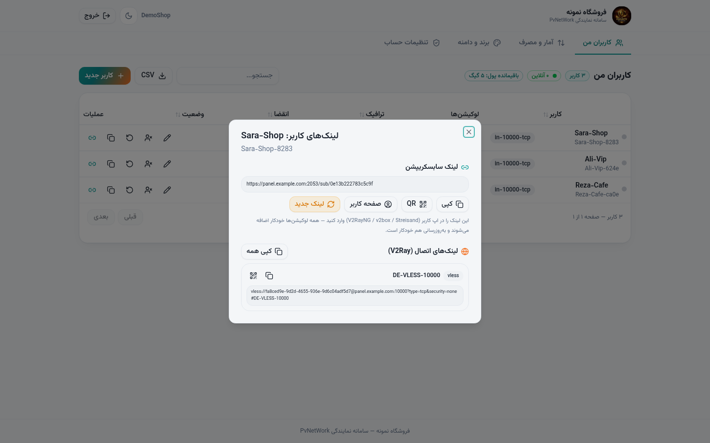

| دکمه | کارکرد |
|---|---|
| لینک سابسکریپشن + ⧉ کپی | لینک خودبه‌روزشونده؛ در اپ کاربر یک بار وارد می‌شود و همه لوکیشن‌ها را می‌آورد |
| **QR** | نمایش کد QR لینک ساب برای اسکن با اپ |
| 👤 صفحه کاربر | باز کردن پورتال اختصاصی کاربر `/s/<subId>` در تب جدید |
| 🔄 **لینک جدید** | اگر لینک قبلی لو رفته: subId عوض می‌شود، لینک قبلی فوراً از کار می‌افتد |
| لینک‌های اتصال (V2Ray) | لینک مستقیم هر لوکیشن (vless/vmess/…) با کپی و QR جداگانه |
| ⧉ کپی همه | کپی همه لینک‌های اتصال یکجا |

### ۱۲) تنظیمات حساب نماینده — منوی «تنظیمات حساب»

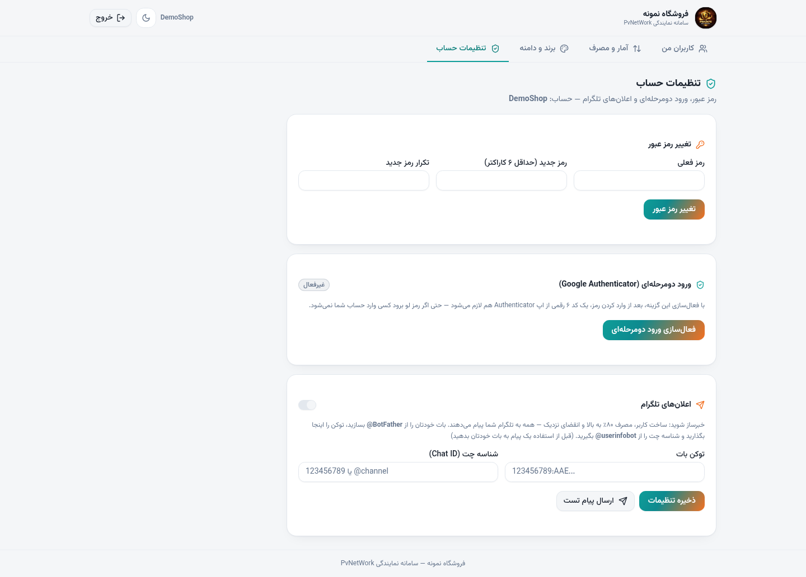

| کارت | کارکرد |
|---|---|
| **تغییر رمز عبور** | رمز فعلی + رمز جدید (حداقل ۶ کاراکتر) + تکرار رمز → «تغییر رمز عبور» |
| **ورود دومرحله‌ای (Google Authenticator)** | «فعال‌سازی ورود دومرحله‌ای» → QR اسکن می‌شود → کد ۶ رقمی تأیید → از این پس بعد از رمز، کد پرسیده می‌شود |
| **اعلان‌های تلگرام** | سوییچ فعال‌سازی + «توکن بات» از [@BotFather](https://t.me/BotFather) + «شناسه چت» (از [@userinfobot](https://t.me/userinfobot) بگیرید) → «ذخیره تنظیمات» → «ارسال پیام تست» |

اعلان‌های تلگرام: ساخت کاربر (تکی/گروهی)، عبور کاربر از ۸۰٪ سهمیه و نزدیکی انقضا — با محدودیت ارسال تا اسپم نشود.

### ۱۳) برند و دامنه اختصاصی — منوی «برند و دامنه»

نماینده نام برند خودش را می‌گذارد و (در صورت داشتن دسترسی وایت‌لیبل) دامنه اختصاصی می‌بندد؛ پورتال کاربرانش با برند خودش بالا می‌آید.

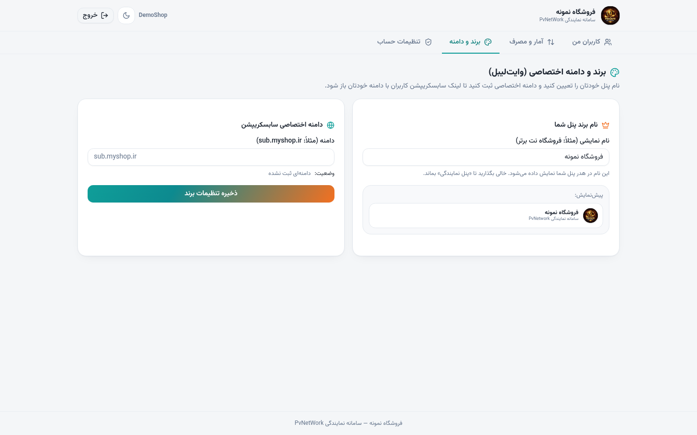

| فیلد / دکمه | کارکرد |
|---|---|
| نام برند پنل شما | مثلاً «فروشگاه نمونه» — در پورتال کاربران، صفحه ورود و مرکز اپ‌ها دیده می‌شود + پیش‌نمایش زنده |
| دامنه اختصاصی سابسکریپشن | مثلاً `sub.myshop.ir` — رکورد `A` آن باید به سرور پنل اشاره کند |
| **ذخیره تنظیمات برند** | ذخیره برند/دامنه + نمایش توکن تأیید |

تأیید مالکیت دامنه با رکورد TXT انجام می‌شود؛ در DNS دامنه بسازید:

```
_pvnet.<نام‌دامنه>  TXT  "pvnet-verify=<توکن از پنل>"
```

سپس وضعیت را از «دامنه‌ای ثبت نشده» به تأییدشده تغییر می‌دهد. بهترین نتیجه: پروکسی نارنجی Cloudflare + حالت SSL = Full.

### ۱۴) پورتال کاربر — `/s/<subId>`

صفحه‌ای که کاربر نهایی می‌بیند: بدون لاگین، با برند نماینده.

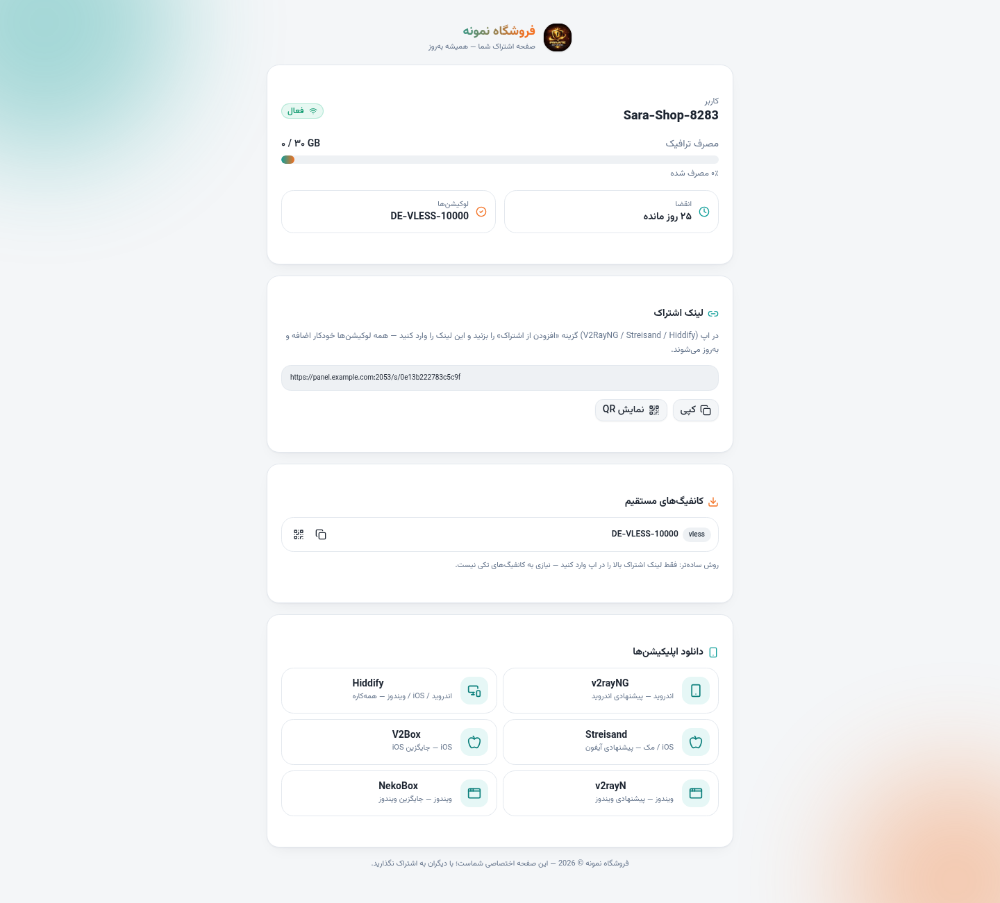

| بخش | کارکرد |
|---|---|
| کارت کاربر | نام، بج «فعال»، مصرف ترافیک با نوار درصد، روزهای مانده، لوکیشن‌ها |
| لینک اشتراک | لینک ساب + «کپی» + «نمایش QR» — در اپ وارد کنید تا همه لوکیشن‌ها خودکار بیایند و به‌روزرسانی هم خودکار است |
| کانفیگ‌های مستقیم | لینک‌های vless/vmess هر لوکیشن با کپی و QR (برای اپ‌هایی که ساب را قبول نمی‌کنند) |
| دانلود اپ‌های پیشنهادی | لینک اپ سازگار با هر پلتفرم |

همچنین خروجی ساب در سه فرمت در دسترس است: `?format=clash` (YAML کلش) و `?format=json`.

### ۱۵) مرکز دانلود اپ — `/apps`

راهنمای دانلود اپ‌های سازگار به تفکیک پلتفرم: v2rayNG، Hiddify، Streisand، V2Box، v2rayN، NekoBox، V2rayXS.

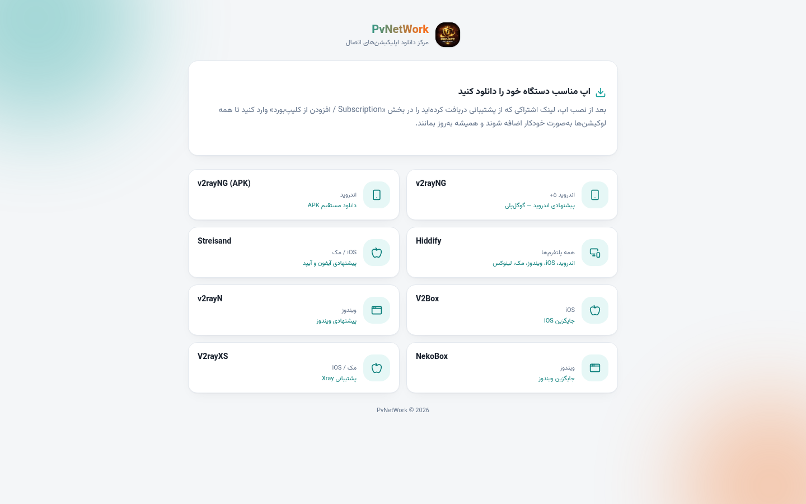

### ۱۶) هسته 3x-ui

هسته واقعی Xray که همه چیز روی آن سوار است؛ پنل نمایندگی همه‌چیز را از API همین هسته می‌خواند/می‌نویسد (اینباندها، کلاینت‌ها، آنلاین‌ها، ترافیک). نصب‌کننده به‌صورت خودکار 3x-ui را با رمز و basePath تصادفی راه می‌اندازد و به پنل وصل می‌کند.

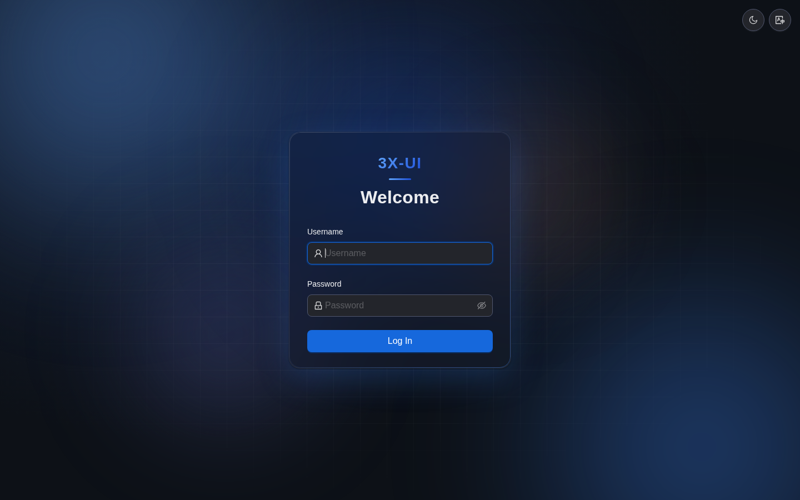

---

## 🔐 امنیت

- رمزها hashed و سکرت‌های 2FA/تلگرام encrypted ذخیره می‌شوند
- **ضدبشکن ورود**: ۱۰ خطای رمز در ۱۵ دقیقه برای هر نام کاربری و ۳۰ خطا برای هر IP = مسدودی ۱۵ دقیقه‌ای (HTTP 429) با ثبت در گزارش فعالیت‌ها
- رمز پیش‌فرض وجود ندارد — رمز ادمین تصادفی تولید و یک‌بار چاپ می‌شود
- 3x-ui با basePath تصادفی (مسیر مخفی) و رمز تصادفی نصب و پیکربندی می‌شود
- هیچ سرتیتی در مخزن نیست؛ همه اعتبارنامه‌ها از env/فایل‌های گیت‌ایگنورشده خوانده می‌شوند
- کلید رمزنگاری (`APP_SECRET`) در زمان نصب تصادفی ساخته می‌شود

## ⚙️ متغیرهای محیطی

| متغیر | پیش‌فرض | توضیح |
|---|---|---|
| `DATABASE_URL` | `file:/app/data/custom.db` | مسیر فایل دیتابیس SQLite |
| `APP_SECRET` | — (الزامی) | کلید رمزنگاری سکرت‌ها و نشست‌ها — رشته تصادفی طولانی |
| `ADMIN_USERNAME` | `admin` | نام کاربری ادمین (فقط بار اول؛ بعداً از پنل تغییر کنید) |
| `ADMIN_PASSWORD` | — | رمز ادمین؛ اگر خالی باشد تصادفی تولید و یک‌بار چاپ می‌شود |
| `PORT` | `3000` | پورت داخلی Next.js |

## 💾 بکاپ و نگهداری

```bash
/opt/pvnet/backup-db.sh                                # بکاپ فوری دستی
/opt/pvnet/panel-data/custom.db.bak-*                  # بکاپ‌ها (روزانه ۰۴:۳۰، نگهداری ۷ نسخه)
bash /opt/pvnet/repo/update.sh                         # آپدیت از مخزن (بکاپ خودکار قبل از آپدیت)
cd /opt/pvnet && docker compose logs -f pvnet-panel    # لاگ زنده پنل
```

برای بازیابی: پنل را متوقف کنید، فایل بکاپ را روی `panel-data/custom.db` کپی کنید و دوباره بالا بیاورید.

## 📁 ساختار مخزن

```
├── install.sh                 ← نصب تک‌خطی روی سرور تازه
├── update.sh                  ← آپدیت (pull + بیلد + ری‌استارت)
├── docker/Dockerfile          ← بیلد چندمرحله‌ای از سورس (bun → node:22-slim)
├── docker/entrypoint.sh       ← آماده‌سازی دیتابیس و اجرا
├── src/app/api/...            ← API ادمین/نماینده/عمومی (ساب، پورتال، لینک‌ها)
├── src/components/panel/...   ← UI پنل (ادمین + نماینده)
├── src/lib/                   ← هسته: اتصال 3x-ui، لینک‌ساز، TOTP، تلگرام، clash، ضدبشکن
├── prisma/schema.prisma       ← اسکیمای SQLite
├── docs/screenshots/          ← اسکرین‌شات‌های همین راهنما
└── scripts/connect_panel.sh   ← ابزار اتصال دوباره پنل به 3x-ui (روی سرور)
```

## ❓ عیب‌یابی سریع

| مشکل | راه‌حل |
|---|---|
| هشدار گواهی در مرورگر | `CF_API_TOKEN` بدهید تا وایلدکارد واقعی صادر شود، یا یک‌بار هشدار self-signed را بپذیرید |
| «هیچ پنلی در دسترس نیست» | تنظیمات و پنل‌ها → تست اتصال → آدرس (با basePath)، رمز و basePath 3x-ui را چک کنید |
| کاربر ساخته نمی‌شود (۴۰۳) | پول ترافیک نماینده پر شده یا اینباندی انتخاب نشده است |
| دامنه اختصاصی تأیید نمی‌شود | رکورد TXT `_pvnet.<دامنه>` را بسازید + پروکسی نارنجی Cloudflare + SSL Full، بعد دکمه ذخیره را دوباره بزنید |
| فراموشی رمز ادمین | رمز را در `/opt/pvnet/.env` عوض کنید و `docker compose up -d pvnet-panel` را اجرا کنید — یا رمز تصادفی بار اول از `CREDENTIALS.txt` |
| ورود با 429 مسدود شد | ۱۵ دقیقه صبر کنید — ضدبشکن خودش باز می‌کند (جزئیات در گزارش‌ها) |
| اعلان تلگرام نمی‌آید | توکن بات و Chat ID را با «ارسال پیام تست» چک کنید؛ سوییچ اعلان‌ها روشن باشد |

