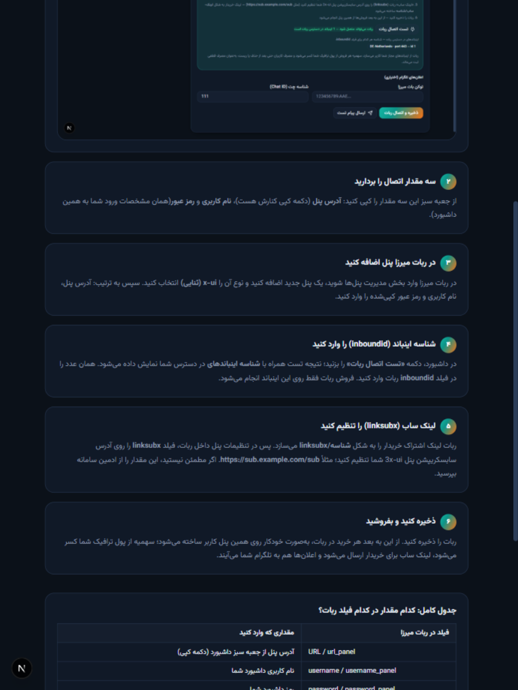

# 📖 راهنمای اتصال ربات میرزا به پنل نمایندگی

این راهنما توضیح می‌دهد چطور ربات میرزا (یا هر ربات سازگار با 3x-ui) را به داشبورد وصل کنید تا خریداران، سرویس را **مستقیم از همین پنل** بخرند و دریافت کنند.

> نماینده‌ها می‌توانند همین آموزش را داخل خود پنل هم ببینند:
> **تنظیمات حساب ← کارت «ربات میرزا پنل» ← دکمه «راهنمای تصویری قدم‌به‌قدم»**
> یا از این آدرس: `/guide/mirza-bot`

## نحوه کار به چه شکلی است؟

```text
خریدار (تلگرام)
   │  سرویس را از ربات شما می‌خرد
   ▼
ربات میرزا
   │  پرداخت را تأیید می‌کند و به پنل وصل می‌شود
   ▼
داشبورد نمایندگی (پل 3x-ui)
   │  کاربر را می‌سازد و سهمیه را از پول ترافیک شما کم می‌کند
   ▼
پنل(های) 3x-ui  ──►  لینک سابسکریپشن برای خریدار ارسال می‌شود
```

ربات با مشخصات **خودِ شما** وارد می‌شود؛ بنابراین فقط به اینباندهایی دسترسی دارد که ادمین به حساب شما داده و سقف پول ترافیک شما نیز برای آن اعمال می‌شود.

## مرحله ۱ — سوییچ اتصال را روشن کنید

وارد پنل نمایندگی شوید ← تب **«تنظیمات حساب»** ← کارت **«ربات میرزا پنل»**.
سوییچ را روشن کنید و دکمه **«ذخیره و اتصال ربات»** را بزنید. جعبه سبزِ تنظیمات اتصال نمایش داده می‌شود:


## مرحله ۲ — سه مقدار اتصال را کپی کنید

از جعبه سبز:
- **آدرس پنل (Panel URL)** — با دکمه کپی کنارش
- **نام کاربری** — همان نام کاربری داشبورد شما
- **رمز عبور** — همان رمز ورود شما به داشبورد

## مرحله ۳ — در ربات میرزا پنل اضافه کنید

در ربات میرزا: **مدیریت پنل‌ها ← افزودن پنل جدید ← نوع: x-ui (ثنایی)**
سپس آدرس، نام کاربری و رمز کپی‌شده را در فیلدهای ربات وارد کنید.

## مرحله ۴ — شناسه اینباند (inboundid)

در داشبورد، دکمه **«تست اتصال ربات»** را بزنید. نتیجه تست و **شناسه اینباندهای** در دسترس شما نمایش داده می‌شود:



همان عدد (مثلاً `17`) را در فیلد `inboundid` پنلِ داخل ربات وارد کنید. فروش ربات فقط روی همین اینباند انجام می‌شود.

## مرحله ۵ — لینک ساب (linksubx)

ربات لینک اشتراک خریدار را به شکل `linksubx/شناسه` می‌سازد. پس فیلد `linksubx` را روی آدرس سابسکریپشن پنل 3x-ui خودتان تنظیم کنید؛ مثلاً:

```text
https://sub.example.com/sub
```

لینک نهایی خریدار به شکل `https://sub.example.com/sub/<شناسه>#نام` خواهد بود که مستقیم توسط پنل 3x-ui سرو می‌شود.
اگر آدرس سابسکریپشن را نمی‌دانید، از ادمین سامانه بپرسید.

## مرحله ۶ — ذخیره و فروش

ربات را ذخیره کنید. از این لحظه:
- هر خرید در ربات، به‌صورت خودکار روی همین پنل کاربر می‌سازد
- سهمیه خریدار از **پول ترافیک** شما کسر می‌شود
- لینک سابسکریپشن برای خریدار ارسال می‌شود
- اعلان ساخت کاربر، مصرف ۸۰٪+ و انقضای نزدیک به تلگرام شما می‌آید
- مصرف کاربران حتی بعد از **حذف یا ریست ترافیک** به‌صورت قطعی ثبت می‌شود و قابل بازیابی نیست

## جدول کامل فیلدها

| فیلد در ربات میرزا | مقداری که وارد کنید |
|---|---|
| `url_panel` / آدرس پنل | آدرس پنل از جعبه سبز داشبورد (دکمه کپی) |
| `username_panel` / نام کاربری | نام کاربری داشبورد شما |
| `password_panel` / رمز عبور | رمز داشبورد شما |
| `inboundid` / شناسه اینباند | عدد نمایش‌داده‌شده در «تست اتصال ربات» |
| `linksubx` / لینک ساب | آدرس سابسکریپشن پنل 3x-ui شما |
| `type` / نوع پنل | x-ui (ثنایی) |

## سوالات پرتکرار

**فروش ربات چقدر از پول من کم می‌کند؟**
دقیقاً به اندازه سهمیه خریدار. مصرف واقعی حتی بعد از حذف یا ریست هم قطعی ثبت می‌شود و به پول برنمی‌گردد.

**ربات به پنل‌های دیگر من دسترسی دارد؟**
خیر. فقط اینباندهایی که برای همین حساب اختصاص یافته و فقط تا سقف پول ترافیک شما.

**تست اتصال ربات خطا می‌دهد؟**
ابتدا سوییچ را روشن و ذخیره کنید. اگر «هیچ اینباندی در دسترس نیست» دیدید، با مدیر سامانه تماس بگیرید.

**چطور دسترسی ربات را قطع کنم؟**
سوییچ کارت را خاموش و ذخیره کنید — بلافاصله تمام درخواست‌های ربات رد می‌شود.
